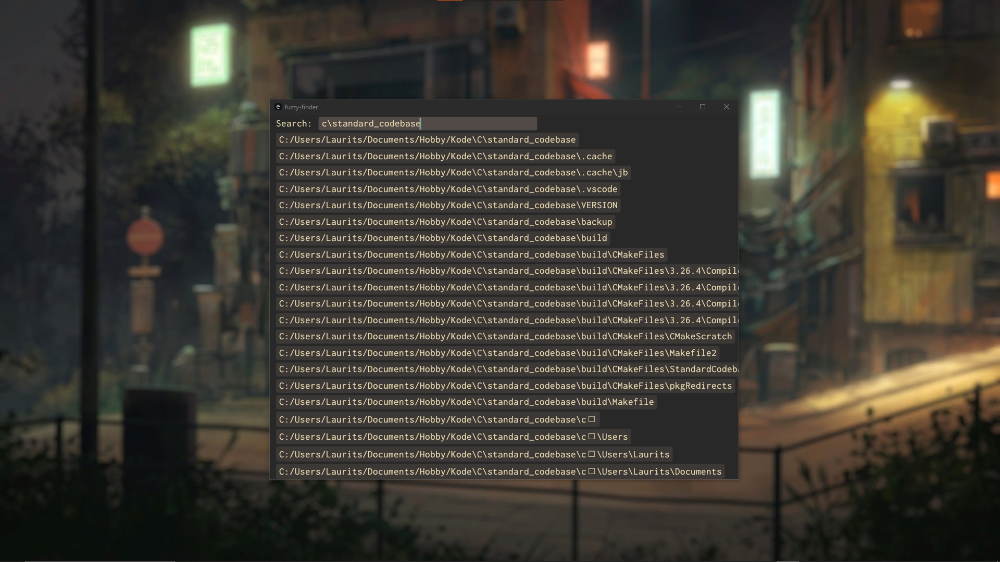

# Fuzzy Finder



## Description

A simple fuzzy finder implented in Rust.

### Features

- Fuzzy search
- Static caching of superdirectory
- Dynamic caching of search results (to narrow search space)
- Instant opening of files or directories in default applications

### Usage

```bash
fuzzyfinder [flags]
```

```txt
# Flags
--help, -h: Prints help information
--version, -v: Prints version information
--direcotry, -d: Specify directory to search in
--cache, -c: Statically cache search directory
```

## Aims

The aim of this project is ...

- to provide easy fuzzy search
- to refamiliarize myself with Egui (the used application library)
- to be a programming exercise

## Non-aims

- to be a full-fledged file manager
- to work on other systems
